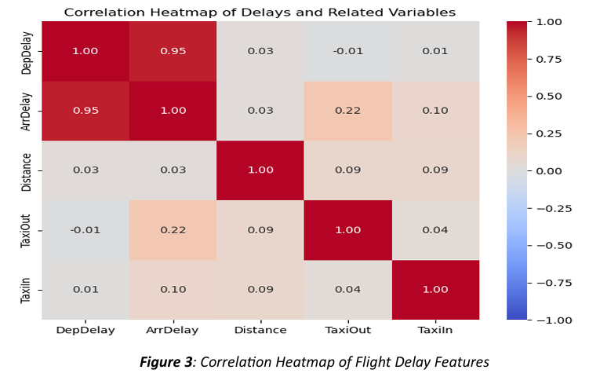

# Introduction  

## 1.1 Problem Statement and Study Objectives  

Flight delays impose significant operational and economic challenges on airlines, airports, and passengers. As air traffic increases, limited airport resources such as gates and runways struggle to meet demand, leading to delays that impact fuel consumption, scheduling efficiency, and passenger satisfaction. This project addresses these challenges by designing a simulation model that replicates real-world flight departure processes while accounting for stochastic delays.  

Using a **Discrete Event Simulation (DES)** approach integrated with **Monte Carlo Simulation**, the project evaluates and optimizes gate and runway utilization to minimize delays. The model incorporates log-normal and Pareto distributions to replicate realistic delay scenarios and tests operational changes such as increasing gates, reallocating resources, or prioritizing flights with tighter schedules. By analyzing these factors, the simulation provides actionable insights for reducing departure delays and improving airport efficiency, supporting data-driven infrastructure investments and resource allocation strategies.  

## 1.2 System Boundary  

The system boundary defines the critical components and processes involved in flight departure operations at an airport. This includes:  

- **Arrival of Flights**: Flights arrive and request gate allocation, with delays influenced by gate availability and scheduling conflicts.  
- **Gate Processes**: Boarding delays are modeled using a log-normal distribution to capture variability in passenger readiness and staff efficiency.  
- **Runway Processes**: After boarding, flights request runway clearance for takeoff. Delays at this stage, including taxiing and sequencing, are modeled using a Pareto distribution to reflect variability in runway operations.  
- **Departure**: Flights successfully take off and exit the system, marking the completion of the departure process within the defined boundary.  

### Scope  
The study focuses on gate and runway resource utilization within a single airport. External factors such as weather, air traffic control, or other airports are excluded to maintain a manageable and focused scope. This approach isolates operational inefficiencies that are directly under the airport's control.  

### Fixed Parameters  
- Number of gates and runways  
- Operational hours of the airport  
- Pre-determined flight schedules  

### Variable Parameters  
- Stochastic arrival times of flights  
- Gate allocation durations  
- Taxi-out and runway clearance times  

These parameters collectively influence the dynamic behavior of the system and are key to understanding and optimizing airport operations.  

## 1.3 Key Performance Measures (KPM)  

This project evaluates system performance using the following key metrics:  

### Total Departure Delay  
- **Definition**: The total time flights spend in the system from gate arrival to successful takeoff.  
- **Significance**: Captures overall efficiency of resource allocation and process flow.  

### Gate Utilization  
- **Definition**: The percentage of time gates are occupied during the simulation period.  
- **Significance**: Reflects gate resource efficiency and identifies underutilized or overburdened gates.  

### Runway Utilization  
- **Definition**: The percentage of time runways are in use during the simulation period.  
- **Significance**: Highlights runway efficiency and potential bottlenecks, especially during peak operations.  

### Average Delay per Flight  
- **Definition**: The average delay time experienced by each flight.  
- **Significance**: Provides a practical indicator of passenger experience and operational efficiency.  

### Resource Waiting Time  
- **Definition**: The time flights spend waiting for gate or runway availability.  
- **Significance**: Offers insights into resource bottlenecks and their contribution to delays, helping identify areas for improvement.  

### Evaluation Goal  
The primary objective is to analyze these performance measures to:  
- Optimize airport resource utilization.  
- Reduce departure delays.  
- Enhance operational efficiency.  
- Improve the overall flight departure process.  

## 2. Modelling Approach  

### 2.1 Collect and Process Real Data  

The dataset for this project, sourced from Kaggle, comprises 484,550 rows of flight information. Key features include *DepDelay* (Departure Delay), *ArrDelay* (Arrival Delay), and various operational metrics. The data underwent pre-processing to ensure quality and suitability for modeling.  

#### Data Pre-Processing  
- **Handling Missing Values**: Rows with incomplete critical columns were removed to maintain data integrity and avoid bias.  
- **Shuffling the Data**: The dataset was shuffled to eliminate temporal patterns that might bias training and validation.  
- **Data Splitting**: The data was divided into two subsets:  
  - 50% for training  
  - 50% for testing  
  This ensured unbiased model evaluation.  

#### Exploratory Data Analysis (EDA)  
To understand relationships between variables and identify factors influencing flight delays, the following analyses were performed:  

1. **Correlation Analysis**:  
   - A correlation heatmap (*Figure 3*) was generated to visualize feature relationships.  
   - **Key Observation**: *DepDelay* (Departure Delay) showed strong correlations with *ArrDelay* (Arrival Delay), highlighting its importance in modeling flight delays.  

2. **Feature Selection**:  
   - Critical variables, such as *DepDelay*, were identified as primary drivers of delay patterns.  
   - These features were prioritized for modeling and simulation.  

3. **Statistical Distribution Fitting**:  
   - Departure delay data was analyzed for distributional properties.  
   - **Distributions Applied**: Log-normal and Pareto distributions were fitted to capture the stochastic nature of delays, effectively reflecting real-world patterns.  

#### Documentation and Visualization  
- **Correlation Heatmap** (*Figure 3*):  
  Visualizes feature relationships, with darker colors indicating stronger correlations. This emphasizes the role of *DepDelay* in predicting delay scenarios.  
- **Pre-Processing Rationale**:  
  Shuffling and data splitting ensured realistic, generalizable representation of the problem and eliminated dataset biases.  

### Correlation Heatmap  

The heatmap below visualizes the relationships between key features. Darker colors indicate stronger correlations, emphasizing the role of `DepDelay` in predicting delay scenarios.  

## 2.2 Formulate and Develop the Model  

The simulation framework was designed using a **Discrete Event Simulation (DES)** approach, augmented with **Monte Carlo Simulation** to capture the stochastic nature of flight operations.  

### Key Components of the Model  

#### 1. Event Definition  
- Flights arrive sequentially at the airport, requesting access to gates and runways.  
- Events are driven by resource availability, with delays modeled as stochastic variables.  

#### 2. Stochastic Delay Modeling  
- **Gate Delays:**  
  Modeled using a log-normal distribution fitted to the training data to represent variability in boarding times.  
- **Runway Delays:**  
  Modeled using a Pareto distribution to reflect the right-skewed nature of runway clearance times.  
- **Monte Carlo Simulation:**  
  Used to sample from these distributions, introducing realistic variability into the simulation.  

#### 3. Resource Allocation  
- The model includes:  
  - **10 Gates**: Representing the boarding and deboarding processes.  
  - **3 Runways**: Representing take-off operations.  
- Flights must request and hold these resources until their respective operations are completed.  

#### 4. Event Flow  
- Flights progress through the following sequential stages:  
  1. **Gate Assignment**  
  2. **Boarding Delay**  
  3. **Runway Assignment**  
  4. **Take-Off**  
- The simulation environment is managed using **SimPy**, which handles resource contention and event scheduling efficiently.  

#### 5. Simulation Execution  
- The simulation runs for a defined period, processing **20 flights** at regular intervals governed by **exponential interarrival times**.  

### Model Highlights  
By integrating discrete event simulation with Monte Carlo techniques, this model captures the inherent variability and complexity of flight operations, providing a robust framework for analyzing and optimizing departure delays.  

## 2.3 Validate and Document the Model  

### Validation Overview  
The model validation ensures that the simulation replicates real-world flight departure dynamics. The validation process involved several steps to confirm the accuracy of the simulation outputs.  

#### 1. Distribution Fitting  
Real-world departure delay data was fitted to **log-normal** and **Pareto** distributions using statistical methods. The fitted parameters were then used to generate synthetic delays during the simulation.  

#### 2. KDE and CDF Comparison  
The **Kernel Density Estimate (KDE)** and **Cumulative Distribution Function (CDF)** of simulated delays were compared with those of the test dataset.  

**KDE Comparison:**  
- The blue line represents the **real data** (departure delays) and the orange line represents the **simulated data**.  
- Figure 4 shows the KDE comparison, where the simulated delays generally match the real data, though there are notable differences in the spread of data.  

**CDF Comparison:**  
- The cumulative probability of delays is illustrated in **Figure 5**, comparing the real (blue) and simulated (orange) data. The comparison indicates a good alignment for short to moderate delays (0 to 100 minutes), but some deviation occurs for longer delays (100 to 200 minutes).  

**Key Insights from the Comparison:**  
1. **Sharp Peak in Real Data (KDE):**  
   - The real data shows a **sharp peak around 0 to 50 minutes**, indicating most real-world flights experience moderate delays. This suggests that delay patterns are skewed, with a concentration near smaller delays.  
   
2. **Broader Peak in Simulated Data (KDE):**  
   - The simulated data has a **broader and less sharp peak** in the same range, implying higher variance and a more spread-out distribution compared to real data.  

3. **CDF Range Observations:**  
   - **Up to 100 Minutes:** The **blue** and **orange** lines are close, indicating the model captures short to moderate delays well.  
   - **100 to 200 Minutes:** A noticeable deviation between the two lines, suggesting some inaccuracy in simulating delays in this range.  
   - **Beyond 200 Minutes:** The deviation increases further, indicating the simulation model fails to capture the longer delays that occur less frequently in the real data.  

#### 3. Cross-Validation  
Testing data was used to evaluate the model's performance under real-world conditions. This cross-validation ensured that the simulation's outputs were consistent with observed behavior.  

### Visual Comparisons:  

#### Figure 4: KDE, CDF Comparison of Real vs Simulated Delays  
  

 
This plot compares the **KDE** of real data (blue) and simulated data (orange), showing how well the simulated delays follow the distribution of the real data.  
This **CDF comparison** shows the cumulative probability of delays, with real (blue) and simulated (orange) data closely aligned, validating the model’s replication of flight delays.  

#### Figure 6: KDE Comparison of Real vs Simulated Delays  
  
Figure 6 shows a detailed comparison of the **KDE** between real and simulated data. The overlap indicates a good match between the distributions.  

#### Figure 7: CDF Comparison of Real vs Simulated Delays  
  
Figure 7 validates the model by comparing the cumulative probability of delays for both the real and simulated datasets, reinforcing the model’s accuracy.  

---
By comparing these plots and analyses, it’s clear that the simulation model closely replicates real-world flight delay behavior, with areas for improvement in simulating the tail end of delay distributions.

